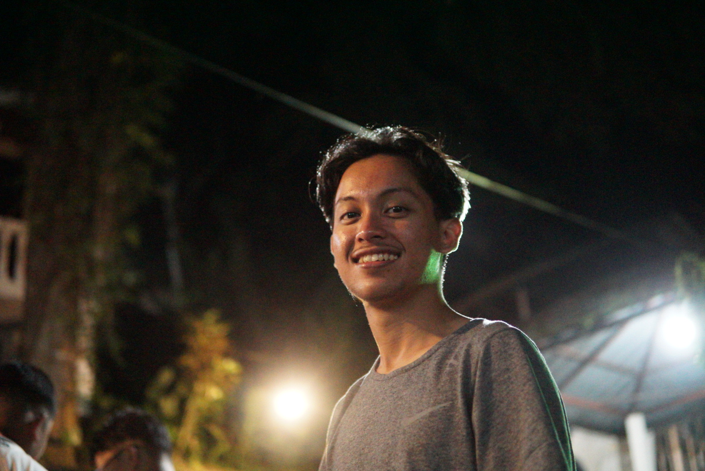

# Introduction
Hi! I'm [DARWISH IRFAN BIN ZULHAILMY], a student in the Framework-Based Software Design and Development course. 
I [expect to learn a lot about modern software maintenance practices and how to work with legacy systems].

- **Fun fact**: I enjoy [doing CTF] and also running a full marathon.
- **Course expectations**: To gain hands-on experience in maintaining and evolving software.

  <!-- Link to the uploaded image -->

## GitHub Profile

You can view my personalized GitHub profile [[wishwhitehat](https://github.com/wishwhitehat)]

